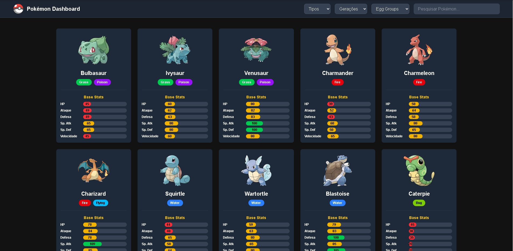

# Projeto Site Pokémon


## 📝 Descrição

Este projeto é uma aplicação web desenvolvida com Next.js e TypeScript, focada na exibição e filtragem de dados de Pokémon. Ele permite aos usuários explorar informações detalhadas sobre diferentes Pokémon, utilizando uma interface moderna e responsiva. O projeto demonstra a integração de dados externos, manipulação de estado e construção de componentes reutilizáveis em um ambiente React/Next.js.

## ✨ Funcionalidades

*   **Exibição de Dados de Pokémon:** Apresenta uma lista de Pokémon com informações essenciais.
*   **Filtragem e Busca:** Permite filtrar Pokémon por tipo, nome ou outras características.
*   **Detalhes do Pokémon:** Visualização de informações detalhadas para cada Pokémon.
*   **Interface Responsiva:** Design adaptável para diferentes tamanhos de tela (desktop, tablet, mobile).
*   **Processamento de Dados:** Inclui lógica para processar dados de Pokémon (mencionado nos commits).

## 🚀 Tecnologias Utilizadas

*   **Frontend:**
    *   
    *   
    *   
    *   
*   **Ferramentas:**
    *   
    *   
    *   

## ⚙️ Instalação e Configuração

Para configurar e rodar este projeto localmente, siga os passos abaixo:

```bash
# Clone o repositório
git clone https://github.com/LucasDuarte42/projeto-site-pokemon.git

# Navegue até o diretório do projeto
cd projeto-site-pokemon

# Instale as dependências
npm install
# ou
yarn install
# ou
pnpm install

# Inicie o servidor de desenvolvimento
npm run dev
# ou
yarn dev
# ou
pnpm dev
```

Abra [http://localhost:3000](http://localhost:3000) no seu navegador para ver o resultado.

## 💡 Como Usar

Após iniciar o servidor de desenvolvimento, a aplicação estará disponível no seu navegador. Você poderá navegar pela lista de Pokémon, utilizar os filtros de busca e visualizar os detalhes de cada um. A interface é intuitiva e projetada para uma experiência de usuário fluida.




## 📂 Estrutura de Diretórios

O projeto segue uma estrutura de diretórios organizada, típica de aplicações Next.js:

```
projeto-site-pokemon/
├── data/                 # Dados estáticos ou processados (ex: dados de Pokémon)
├── public/               # Arquivos estáticos (imagens, fontes, etc.)
├── src/                  # Código fonte da aplicação
│   ├── app/              # Rotas e páginas da aplicação Next.js
│   ├── components/       # Componentes React reutilizáveis
│   └── types/            # Definições de tipos TypeScript
├── .gitignore            # Arquivos e diretórios a serem ignorados pelo Git
├── README.md             # Este arquivo
├── package.json          # Metadados do projeto e dependências
├── tailwind.config.ts    # Configuração do Tailwind CSS
├── tsconfig.json         # Configuração do TypeScript
└── ...                   # Outros arquivos de configuração (eslint, postcss, etc.)
```

## 📄 Licença

Este projeto está licenciado sob a Licença MIT. Veja o arquivo [LICENSE](LICENSE) para mais detalhes. (Se você não tiver um arquivo LICENSE, considere adicionar um.)

## 📞 Contato

*   **Lucas Duarte** - [LinkedIn](https://www.linkedin.com/in/lucas-duarte-54b644297)
*   **GitHub:** [LucasDuarte42](https://github.com/LucasDuarte42)

---
